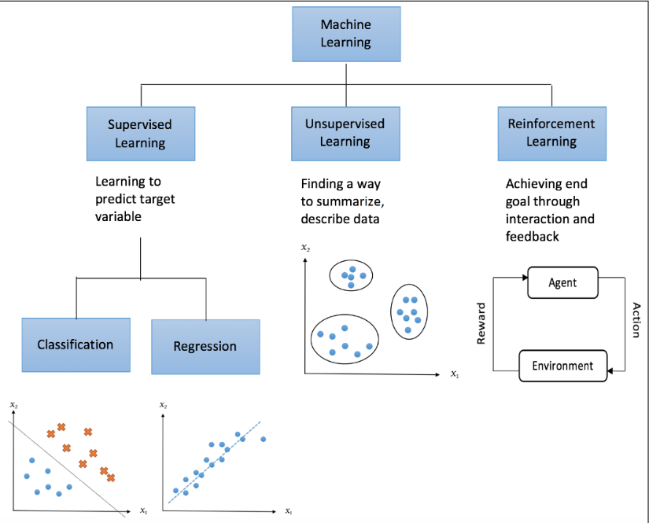

# Chapter 1: Getting Started

A machine learning system is fed with input data — numerical, textual, visual, or audiovisual

System will have an output — floating-point number, integer representing a category (**class**)

 Main purpose is to explore and construct algorithms that can learn from historical data and make predictions on new input data

Three categories:

# Unsupervised Learning

Data only contains indicative signals without any description attached. 

- goal is to find the structure of the data underneath: determine how to describe the data
- Data is called **unlabeled data**
- Can be used to detect anomalies, such as fraud, defective equipment, or to group customers with similar online behaviors for a marketing campaign.
- Includes **dimensionality reduction**

# Supervised Learning

Learning data comes with a description, targets, or desired output besides indicative signals

- The goal is to find a general rule that maps input to output
- Works with **labeled data,** and maps new data with an unknown ouput
- Labels are usually provided by event-logging systems or evaluated by humans
    - crowd sourcing
- Used in face and speech recognition, products or movie recommendations, sales forecasting, and spam email detection

Can be divided into two subcategories

## Regression

**Regression** trains and predicts continuous-valued responses

- predicting house prices, stock market

## Classification

**Classification** attempts to find the appropriate class label, such as analyzing a positive/negative sentiment and predicting a loan loan default.

# Reinforcement Learning

Learning data provides feedback so that the system adapts to dynamic conditions in order to achieve a certain goal

- The system evaluates its performance based on feedback responses and reacts accordingly
- robotics, self-driving cars, AlphaGo

# Semi-Supervised Learning

When not all the data are labeled. It makes use of unlabeled data for training, besides a small amount of labeled data

- applied in cases where it is expensive to acquire a fully labeled dataset and more practical to label a small subset
    - Labeling hyperspectral remote sensing images

# Brief History on the Development of ML Algorithms

Began with **logic-based systems** 

- used basic rules specified by human experts, and tried to reason using formal logic, background knowledge, and hypotheses
- **Statistical learning** theory attempts to find a function to formalize the relationships between variables.

Then came **artificial neural networks (ANNs)** came in 1980s

- mimic neurons in animal kingdom

**Genetic Algorithms (GA)** were popular in the 1990s

- mimic biological evolution and try to find the optimal solutions using methods such as mutation and crossover

Currently seeing a revolution in **deep learning**

- neural networks with many layers
- Breakthrough in learning came with the integration and utilization of **Graphical Processing Units (GPUs)**

**Moore's Law:** empirical observation claiming that compute hardware improves exponentially over time

- Co-founder of Intel Gordon Moore in 1965
- Transistors on a chip should double every two years
- Should be valid for a couple of decades

# Core of Machine Learning

## Generalizing with Data

**Generalization:** learning something from practice questions and applying the knowledge to other similar questions

- **training sets** or **training samples**
    - practice questions
- Actual exams are the **testing sets** or **testing samples**
    - What we want to apply the model to

Learning effectiveness is measured by the compatibility of the learning models and the testing

- Mock exams to assess how well the model will perform on the testing sets are the **validation sets** or **validation samples**
    - can fine-tune the models based on the performance

## Overfitting, Underfitting, and the bias-variance trade-off

### Overfitting

The model fits the existing observations **too well** but fails to predict future new observations

- Extracting too much info from the training sets and making our model just work well with them → **low bias**
- **Bias:** the difference between the average prediction and the true value
  
    $$
    Bias[\hat{y}]=E[\hat{y}-y]
    $$
    
    $\hat{y}$  is the prediction. 
    
- Overfitting won't help us to generalize to new data and derive true patterns
    - Model will perform poorly on datasets that weren't seen before
    - Leads to **high variance** in ML
    - **Variance** measures the spread of the prediction, which is the variability of the prediction
    
    $$
    V=E[\hat{y}^2]-E[\hat{y}]^2
    $$
    

- Occurs when we try to describe the learning rules based on too many parameters relative to the small number of observations, instead of the underlying relationship
- Also occurs when we make the model excessively complex so that it fits every training sample
    - analogous to memorizing the answers for all questions

### Underfitting

Model doesn't perform well on the training sets and won't do so on the testing sets

- fails to capture the underlying trend of the data
- May occur if we aren't using enough data to train the model (not reviewing enough for an exam)
- Trying to fit a wrong model to the data (practicing wrong exercises for an exam)
    - Has **high bias →** high bias ML
    - Low variance, because the predictions are all similar, but in a bad way

### The bias-variance trade-off

**Bias** is the error stemming from incorrect assumptions in the learning algorithm

- high bias results in underfitting

**Variance** measures how sensitive how sensitive the model prediction is to variations in the datasets

We want to avoid bias or variance becoming too high → make both as low as possible

- there is a trade-off, where decreasing one of the two will increase the other

Minimizing the total error of a model requires a careful balancing of the two. Giving a set of training samples: $x_1, x_2,\dots,x_n$ and targets $y_1,y_2,\dots,y_n$, we want to find a regression function $\hat{y}(x)$  that estimates the true relation $y(x)$ as correctly as possible. The error is of the regression model is the **mean squared error (MSE):** 

$$
MSE=E[(y(x)-\hat{y}(x))^2]
$$

The $E$ denotes the expectation. This error can be decomposed into bias and variance components following the analytical derivation: 

The more complex the learning model $\hat{y}(x)$ is, and the larger the size of the training samples, the lower the bias will become. However, this will also create more shift to the model in order to better fit the increased data points. 

- means the variance will increase

Employ **cross-validation techniques** and **regularization** and **feature reduction** to find the optimal model balancing bias and variance. 

It is easy to verify that model is underfitting: it simply does not have high accuracy. It is more difficult to verify whether a model is overfitting → will work on all your training data and then fail when subjected to real-world tests.

## Cross-Validation

Use "mock exams" as validation for training. It helps evaluate how the models will generalize to independent or unseen datasets in a simulated setting.

- Original data is usually partitioned into three subsets: 60% for training, 20% for validation, and 20% for testing (approximately)
    - This setting suffices if we have enough training samples after partitioning and we only need a rough estimate of simulated performance. Otherwise, use cross-validation

In one round of CV, the original data is divided into two subsets: **training,** and **validation (testing)**

The testing performance is recorded.

- multiple rounds of CV are performed under different partitions
- Testing results from all rounds are finally averaged to generate a more reliable estimate of model prediction performance
- Reduces variability → limits overfitting

There are to CV schemes: exhaustive and non-exhaustive

### Exhaustive Scheme

We leave out a fixed number of observations in each round as testing/validation samples and use the remaining observations as training samples

- Process is repeated until all possible different subsets of samples are used for testing once
- We can apply **Leave-One-Out-Cross-Validation (LOOCV)**, which lets each sample be in the testing set once.
    - For a dataset of size $n$, LOOCV requires n rounds of cross-validation

### Non-exhaustive Scheme

Does not try out all possible partitions. The most widely used type of this scheme is the **k-fold cross validation.** 

- First, randomly split the original data in to **k equal-sized** folds
- In each trial, one of these folds becomes the testing set, and the rest of the data becomes the training set
- Repeat this process $k$  times, with each fold being the designated testing set *once*
- Common values for $k$ are 3, 5, and 10.

K-fold cross-validation has a lower variance than LOOCV → using a chunk of samples instead of a single one for validation

H**oldout** method: we can also randomly split the data into training and testing sets numerous times

- Problem is that some samples may never end up in the testing set, while some may be selected many times

Last is the **nested cross-validation** scheme, which is a combination of cross-validations:

- **Inner cross-validation:** This phase is conducted to find the best fit and can be implemented as a *k*-fold cross-validation
- **Outer cross-validation:** This phase is used for performance evaluation and statistical analysis

## Regularization

**Regularization** adds extra parameters to the error function we're trying to minimize, in order to punish complex models

Simpler methods are to be favored → Occam's Razor

- we can invent few simple models than complex models
    - $y=ax+b$ has less parameters than a quadratic model or 3D+ model
        - Fewer parameters to optimize
- Easier to capture a model with a **high-order polynomial function**
    - Larger search space
- Easily obtained models generalize worse than linear models and are more prone to overfitting
    - Require more computation time

The linear model is preferable as it may generalize better to more data points drawn from the underlying distribution. 

- Use regularization to reduce the influence of the high orders of polynomial by imposing penalities on them
    - Discourages complexity, even though a "less accurate" and "less strict rule" is learned from the training data
- Stop training procedure early: limiting time a model spends learning or setting stopping criteria can produce a simpler model
    - Less likely to overfit

## Feature Selection and Dimensionality Reduction

Typically represent data as a grid of numbers (matrix). 

- Each column represents a variable → a **feature**

In supervised learning, of of the variables is actually not a feature, but label that we're trying to predict

- Each row is an example that we can use for training or testing

Number of features corresponds to the dimensionality of the data

- Fitting high-dimensional data is computationally expensive and prone to overfitting
    - Also impossible to visualize

Not all features are useful and they may only add randomness to the results

- Probably true for my Twitter Neural Net

### Feature Selection

Not all features are important. FS picks a subset of significant features for use in better model construction.

- Boils down to multiple binary decisions about whether to include a feature
- For n features, we get $2^n$ feature sets
    - Very large function of n
    
    $$
    2^n=\sum_{k=0}^n {2 \choose k}
    $$
    

Two options: start with all the features and remove features, or start with a minimum set of features and add features iteratively

- Take the best feature sets for each iteration and compare them

### Dimensionality Reduction

Transform high-dimensional data into a lower-dimensional space.

- **Dimensionality Reduction** or **Feature Projection**

# Data preprocessing and Feature Engineering

**Data Mining:** predecessor of data science in the 1990s

One of the most popular strategies is the **Cross-Industry Standard Process for Data Mining (CRISP-DM).**

CRISP-DM consists of the following phases, which aren't mutually exclusive and can occur in parallel:

- **Business understanding;** Often taken care of by specialized domain experts. Formulate a business problem that requires a solution (e.g. selling more units of a product)
- **Data understanding:** The exploration phase where a technical specialist needs to get involved more than in the  business understanding phase.
- **Data preparation:** Create training and testing datasets → **preprocessing phase**
- **Modeling:** Formulate a model to fit our data, the machine learning phase
- **Evaluation:** Evaluate how well it model fits the data to check whether it solves the problem
- **Deployment:** Setting up the system in a production environment

# Preprocessing and Exploration

Must clean the data so that the machine can ignore the unimportant gibberish.

- Requires us to be familiar with the data

How to proceed:

1. Scan the data 
2. Visualize the data

Depends on the type of data being dealt with: numbers, images, audio, etc.

- Always work towards numerical figures

Feature Scanning

- Determine if features are missing values, type of features
- See if the values resemble any distribution (e.g. normal, binomial, Poisson)
- Check type: integers, positive vs. negative, categorical, yes or no, etc.

## Dealing with missing values

You can't always have all the values you need

- Missing equipment, happened in the past, etc.
- Possible to just figure out what the value was, either by guessing, scanning other data, etc.
- Some systems encode missing values with an arbitrary number (e.g. -1, 999,999), assuming its out of range for the values you are working with

How to deal with them:

- Ignore them
    - Easiest solution, but some programs cannot proceed without the values.
    - Sometimes, it will lead to inaccurate results
- **Imputing:** Substitute missing value with a fixed value
    - Using the **mean, median,** or **mode**
    - Should have prior knowledge that will narrow down the decision for the fixed value

## Label Encoding

Use label encoding to help distinguish categories, as most programs cannot simply just deal with a string outright. Each label can have a unique value:

Approach can be problematic:

- Learner may conclude that there is an order (bad = 0, ok = 1, good = 2, excellent = 3).
- Hard to quantify categories

## One-Hot Encoding

**One-of-K,** or **one-hot encoding** scheme uses dummy variables to encode categorical features

- dummy variables have binary values such as bits, so they take the values zero or one (true or false)
- Have `is_asia` be the variable, which is only true when the continent is *Asia* and false otherwise.
- Need as many dummy variables as there are unique labels - 1
- We can determine one of the labels automatically variables, because they are exclusive
- All false = the value is the one we don't have a dummy variable for

Encoding produces a matrix with many zeros and occasionally ones → called a **sparse matrix**

The sparse matrix can be handled by the `scipy` package

# Scaling

Values of different features can differ by orders of magnitude. 

- Larger values can dominate smaller values, depending on the algorithm we use

Strategies to scale the data:

- **Standardization**
    - $Z=\frac{x-\mu}{\sigma}$
    - Normalize the data with a **Gaussian Distribution**
- Use median and divide by interquartile range → for non-normal distributions
    - **Interquartile range** is the range between the first and third quartile (25 and 75th percentile)
- Scaling features to a range between zero and one is common

# Feature Engineering

**Feature Engineering** is the process of improving or creating features.

- No guarantee that the features will improve results
- Use clusters found by unsupervised

**Deep neural networks** are often able to drive features **automatically**

## Polynomial Transformation

Given features $a$ and $b$, we can suspect that there is a polynomial relationship, such as $a^2+ab+b^2$. We can consider each term in the sum to be a feature:

- $a, b,$ and $a^2+ab+b^2$, where $ab$ is called an **interaction**
- The interaction doesn't have to be a product: can be sum, difference, ratio, etc.
    - most commonly a product

Number of features and order of the polynomial for a poly-relation are not limited

- Avoid higher-order polynomials and interactions of many features → following Occam's Razor
    - Tend to overfit and are more difficult to compare
    - May be worth it if you need better results

## Power Transforms

Power transforms are functions that transform numerical features in order to conform better to a normal distribution

- Common transformation for values that vary by magnitudes is to take the **logarithm**
    - Add constant to account for minimum value so it is not less than or equal to 0
    - Can square root, square, etc.

### **Box-Cox transformation**

- Named after George Box and David Roxbee Cox
- Attempts to find the best power needed to transform the original data into data that's closer to the normal distribution

$$
y_i^{(\lambda)}=\begin{cases}
{\frac{y^{\lambda}-1}{\lambda}} &\quad \lambda\neq 0  \\
\ln(y_i) &\quad \lambda = 0
\end{cases} 
$$

## Binning

Separate feature value into several bins

- Only interested if it rained on a particular day
    - True value if the precipitation value isn't zero, and false otherwise
    - Use statistics to divide values into high, low, and medium bins
- Care about age group, rather than age (e.g. 18-24 instead of 23)

# Combining Models

Model takes preprocessed data nd produces predictive results. What if we employ multiple models? Will we make better decisions by combining predictions from individual models?

A team can produce better results thana single person. In ML, prefer to have models cooperate with the following schemes:

- Voting and averaging
- Bagging
- Boosting
- Stacking

## Voting and Averaging

Final output will be the **majority** or **average** of prediction output values from multiple models

- Can assign different weights to individual models in the ensemble

Combining results of highly correlated models doesn't guarantee significant improvement

- Can remove very similar models or proportionally weigh them less

## Bagging

**Bootstrap aggregating/bagging** applies **bootstrapping** to machine learning problems

- Introduced by Leo Breiman in 1994
- Statistical procedure that creates multiple datasets from the existing one by sampling data with replacement
- Can be used to measure properties of a model, like bias and variance

Follows these steps:

1. Generate new training sets from input training data by sampling with replacement
2. For each generated training set, we fit a new model
3. Combine the results of the models by averaging or majority voting

Can reduce overfitting → samples are obviously smaller, and we're combining multiple models that each have their strengths

Workflow of bagging for classification

## Boosting

**Weak learners** are learners who are just a little bit better than a baseline

- Randomly assigning classes or average values
- Learn weak individually, but can do well together (INTERFEROMETER?)

In **boosting,** each model is trained on the same dataset, but each data sample is under a different weight factoring in the previous model's success ****

- Models are trained in sequence, rather than in parallel as in bagging

Weights are assigned after a model is trained, which will be used for the next training round. 

- Weights for mis-predicted samples are increased to stress their prediction difficulty

Boosting algorithms differ mostly in their weighting scheme

- Identifying problems you struggle with on a practice exam

Face detection in images is based on a specialized framework that uses boosting

- Detecting faces in images or videos is supervised learning
    - Imbalance, as many more regions without faces
- Cascade of classifiers progressively filters out negative image areas stage by stage
    - In each progressive stage, the classifiers use progressively more features on few image windows
        - Spend most of the time on image patches that contain faces
- Boosting here is used to select features and combine results
    - Guessing that empty regions are given little weight

## Stacking

Stacking takes the output values of ML models and then uses them as input values for another algorithm

- Feed the output of the higher-level algorithm to another predictor
- It's possibly to use any arbitrary topology but, for practical reasons, you should try a simple setup first → Occam's Razor