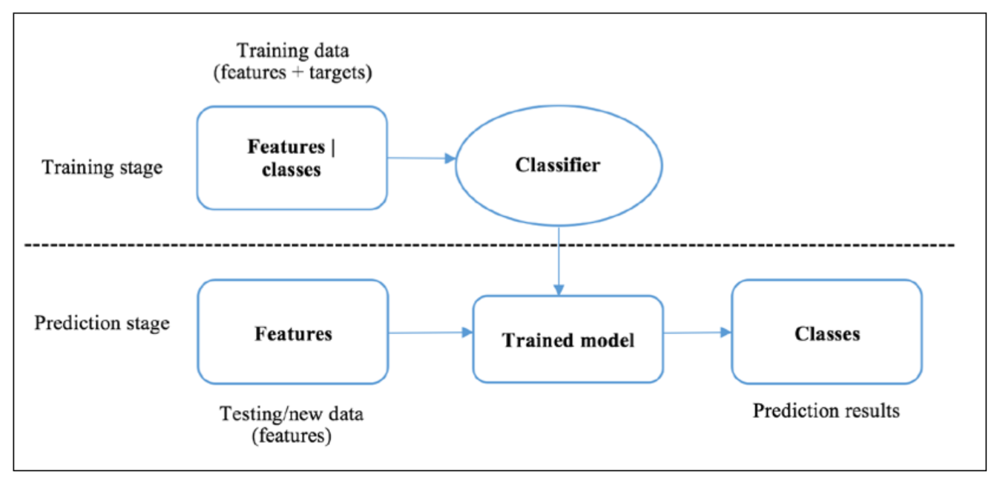

# Chapter 2: Building a Movie Recommendation Engine with Naïve Bayes

# Getting started with classification

**Classification:** goal is to learn a general rule that correctly maps the **observations** (features, predictive variables) to the target **categories** (labels, classes)



Three types of classification based on categorical output: **binary, multiclass,** and **multi-label classification**

## Binary Classification

Putting observations in one of two possible classes:

- Spam or not spam
- High risk vs Low Risk Patients
- Ad will be clicked or not clicked
- Will like a movie vs. not like a movie


## Multiclass Classification

Also called **multinomial classification.** Allows more than two possible classes, compared to binary classification.

- Handwritten digit recognition (reading zip codes)
    - Became a "Hello, World!" in journey of studying machine learning
    - Scanned modified data set from NIST called **MNIST (Modified National Institute of Standards and Technology)** → benchmark dataset


## Multi-label Classification

In the first two types of classification, target classes are *mutually exclusive*. Multilabel classification allows features to be categorized by multiple labels.

- Classifying a picture of the sea and the sunset → multi-label
- Picture of a dog or cat is just a cat → binary
- Picture of fruits with apples, bananas, oranges, etc. → multiclass
- Protein function classification, where each protein can have multiple functions

Typical approach to solving a *n-*label classification problem is to transform it into a set of *n* binary classification problems, where each binary classification problem has its own individual binary classifier.


Multiple classification algorithms: Naïve Bayes, **support vector machine** **(SVM),** decision tree, and logistic regression

# Exploring Naïve Bayes

Belongs to family of probabilistic classifiers. Computes the probabilities of each predictive **feature** (**attribute, signal)** of the data belonging to each class to make a prediction of the probability distribution over all classes. It finds most probable category.

- **Bayes:** Maps the probability of observed input feature given a possible class to the probability of the class given observed pieces of evidence based on Bayes' theorem
- **Naïve:** Simplifies probability computation by assuming that predictive features are mutually independent.

## Bayes' Theorem

Let *A* and *B* denote two events. 

- *A*: it will rain tomorrow
- *B:* a person has cancer

Bayes' theorem:

$$
P(A|B)=\frac{P(B|A)P(A)}{P(B)}
$$

### Example 1:

Given two coins, one is unfair, with 90% of flips getting a head and 10% getting a tail, while the other one is fair. Randomly pick one coin and flip it. What is the probability that this coin is the unfair one, if we get a head?

Let *U* represent getting the unfair coin, and *H* represent getting a head. We have:

$$
P(U|H)=\frac{P(H|U)P(U)}{P(H)}
$$

$P(H|U)$: Probability of getting heads with an unfair coin: $0.9$

$P(U)$: Probability of getting the fair coin: $0.5$

$P(H)$: Probability of getting heads. This requires us to sum the probability of getting heads with either the unfair or fair coin. Symbolically, we can represent this as:

$$
P(H)=P(H|U)P(U)+P(H|F)P(F)
$$

Therefore, we have: $(0.5)(0.9) + (0.5)(0.5) = 0.7$

Overall, we have:

$$
P(U|H)=\frac{(0.9)(0.5)}{0.7} =\frac{9}{14}\approx 0.64
$$

## The mechanics of Naïve Bayes

Given a data sample $x$ (singular) with $n$ features, $x_1,x_2,\dots, x_n$ (where $x = (x_1,x_2,\dots,x_n)$) the goal of Naïve Bayes is to determine the probabilities that this sample belongs to the $K$ possible clauses $y_1,y_2,\dots, y_n$ with is $P(y_k|x)$  or $P(x_1,x_2,\dots,x_n)$  where $k=1,2,\dots, K$.

This is a joint event where a sample that has observed feature values $x_1,\dots,x_n$. The event $y_k$ is the event that the sample belongs to a class $k$. Applying Bayes' theorem:

$$
P(y_k|x)=\frac{P(x|y_k)P(y_k)}{P(x)}
$$

Looking at each component in detail:

- $P(y_k)$ portrays how classes are distributed, with no further knowledge of observation features. It is called **prior** in Bayesian probability terminology. It can either be predetermined (usually in a uniform manner where each class has an equal chance of occurrence) or learned from a set of training samples.
- $P(y_K|x)$ in contrast is the **posterior**, with extra knowledge of observation.
- $P(x|y_K)$ or $P(x_1,\dots,x_n|y_K)$ is the joint distribution of n features, given that the sample belongs to class $y_K$. This is how likely the **features** with such values co-occur. It is called the Bayesian **likelihood.** It will be more difficult to compute as the number of features increases. In Naïve Bayes, this is solved because we assume independence of features. The join conditional distribution of *n* features can be expressed as the joint product of individual feature conditional distributions

$$
P(x|y_k)=P(x_1|y_k) \cdot P(x_2|y_k) \cdot \dots \cdot P(x_n|y_k)
$$

Each conditional distribution can be effectively learned from a set of training samples.

- $P(x)$ is called the **evidence.** It solely depends on the overall distribution of features, which is not specific to certain classes and is therefore a normalization constant. As a result, the posterior is proportional to prior and likelihood.

$$
P(y_k|x) \propto P(x|y_k)P(y_k)=P(x_1|y_k)P(x_2|y_k)\dots P(x_n|y_k)
$$


### Example of Applying Naïve Bayes to a Movie Recommendation System

Naïve Bayes classifier in action on a simplified example of a movie recommendation system.


Use the three movies $m_1$, $m_2$, and $m_3$ as features so we can predict whether a person will like a target movie. We have 4 training samples.

Computing the priors $P(Y)$ and $P(N)$ for the target movie:

$$
P(Y)=3/4\\P(N)=1/4
$$

Alternatively, we can impose the assumption that $P(Y)=50 \%$ (example).

Denote the event that a user likes three movies or not as $f_1, f_2, f_3$, respectively. Calculating the posterior:

- $P(Y|x)$  for $x=(1,1,0)$, we must compute $P(f_1=1|Y), P(f_2=1|y)$, and $P(f_3=0|Y)$ (and when we have Ns as well).
- Given that we did not find $f_1=1$ for the $N$ class, we will get $P(f_1=1|N) = 0$.
- Consequently, we will have:

$$
P(N|x) \propto P(f_1=1|N) \cdot P(f_2=1|N)= 0
$$

- Indicates that the model will guess $Y$ no matter what, as there is 0 probability for $P(N|x)$ to occur

We use **Laplace smoothing** to eliminate the zero-multiplication factor.

- Assign an initial value of 1 to each feature
- Start counting each possible value of a feature from one

Applying to the example above:

$$
P(f_1=1|N)=\frac{0+1}{1+2}=\frac{1}{3} 
$$

$$
P(f_1=1|Y) = \frac{1+1}{3+2}=\frac{2}{5}
$$

Given class $N$, $0 + 1$ means there are zero likes of $m_1$, plus +1 for smoothing

$1+2$ indicates that there is one data point (ID = 2) plus 2 (two possible values) +1 smoothings.

Given a class $Y$, $1 + 1$ means there is one like of $m_1$ (ID = 4) plus 1 smoothing; $3+2$ means there are three data points (ID = 1, 3, 4) plus two (two possible values) +1 smoothings. 


Rest of the equations

Comparing the ratio between the two posteriors is as follows:

$$
\frac{P(N|x)}{P(Y|x)} \propto \frac{P(N) \cdot P(f_1=1|N) \cdot P(f_2 = 1 | N) \cdot P(f_3 = 0 | N)}{P(Y) \cdot P(f_1=1|Y) \cdot P(f_2 = 1|Y) \cdot P(f_3=0|Y)} = \frac{125}{1458}
$$

Since:

$$
P(N|x)+P(Y|x)=1
$$

By solving the system of equations, we obtain:

$$
P(Y|x) = 1-125/1583=92.1\%
$$

# Implementing Naïve Bayes

[Meet Google Drive - One place for all your files](https://drive.google.com/drive/u/0/folders/12_fO1V99snL1UiJV3w5hM1989MFNRUGk)

## [BernoulliNB](https://scikit-learn.org/stable/modules/generated/sklearn.naive_bayes.BernoulliNB.html)

Naïve Bayes classifier for multivariate Bernoulli models. Desgined for binary/boolean features.

```python
from sklearn.naive_bayes import BernoulliNB as BNB

clf = BNB(alpha=X, fit_prior=True/False)
clf.fit(X_train, Y_train)
```

## [MultinomialNB](https://scikit-learn.org/stable/modules/generated/sklearn.naive_bayes.MultinomialNB.html)

Naïve Bayes classifier for multinomial models. Classifies discrete features and can handle multiple features. Normally requires integer feature counts.

```python
from sklearn.naive_bayes import MultinomialNB as MNB

clf = MNB(alpha=X, fit_prior=True/False)
clf.fit(X_train, Y_train)
```

# Evaluating Classification Performance

- Confusion Matrix
- Precision
- Recall
- F1 Score
- Area under the curve

A **confusion matrix** summarizes testing instances by their predicted values and true values, presented as a contingency table:


$$
Accuracy=\frac{TN+TP}{TN+TP+FN+FP}
$$

The **precision** measures the fraction of positive calls that are correct, which is $\frac{TP}{TP + FP}$.

**Recall** measures the fraction of true positives that are correctly identified (people who are actually positive): $\frac{TP}{TP+FN}$.

The **f1 score** includes both the precision and the recall, and equations to their harmonic mean (averaging "rates"): 

$$
f_1=2*\frac{precision * recall}{precision + recall}
$$

We tend to value the f1 scores more than the individual precision and recall scores.

Implementing these with Scikit-Learn:

```python
from sklearn.metrics import precision_score, recall_score, f1_score, confusion_matrix

# labels are in order neg, pos
confusion_matrix(Y_test, prediction, labels=[0, 1])

# pos label can depend on context
precision_score(Y_test, prediction, pos_label=1)

recall_score(Y_test, prediction, pos_label=1)

f1_score(Y_test, prediction, pos_label=1)
```

Can simplify displaying the results with `classification_report`

```python
from sklearn.metrics import classification_report

classification_report(Y_test, prediction)
```

The classification report provides a comprehensive view of how the classifier performs on each class. It is useful in imbalanced classification, where we can easily obtain a high accuracy by simply classifying every sample as the dominant class 

- Precision, recall, and f1 score measurements for the minority class, will be significantly low.
- You can choose to have higher accuracy by using the class that has more data points
- Balance between greater accuracy for the dominant class and less accuracy for the minority class

Precision, recall, and f1 score are applicable for **multiclass** classification

- Simply treat a class we are interested in as a positive class, and any other classes are negative cases

While tweaking binary classifiers, we want a set of parameters in which the highest averaged and class individual f1 scores are achieved at the same time.

- It is usually not the case
- A model can have a higher average f1 score than another model, but a significantly low f1 score for a particular class
    - Sometimes will have the same average f1 scores, but another has a higher f1 score on one class and a lower score for another class

The big question: ***How do we decide which model is better?***

We can use the **area under the curve (AUC)** of the **receiver operating characteristic (ROC),** a consolidated measurement frequently used in binary classification. 

The ROC curve is a plot of the true positive rate versus the false positive rate at various probability thresholds, ranging from 0 to 1. 

- For a testing sample, if the probability of a positive class is greater than the threshold, then a positive class is assigned; otherwise, a negative class is assigned
    - True positive rate is the recall and the false positive rate is the fraction of negatives that are incorrectly identified as positive