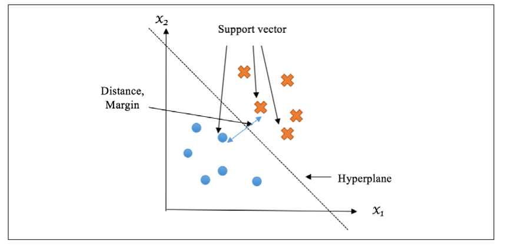

# Chapter 3: Recognizing Faces with Support Vector Machine

**Support Vector Machine (SVM)** classifiers are one of the most popular algorithms in high-dimensional spaces.

The goal of the algorithm is to find a decision boundary in order to separate data from different classes ****

- Face recognition, fetal state categorization, breast cancer prediction

Use a dimensionality reduction technique called **principal component analysis,** which boost the performance of image classifiers

# Finding the separation boundary with SVM

SVM finds an optimal hyperplane that best segregates observations from different classes.

A **hyperplane** is a plane of $n-1$ dimensions that separates the *n*-dimensional space of the observations into two spaces.

- 2D hyperplane is a line that separates two regions
- 3D hyperplane is a surface that separates two regions

The optimal hyperplane is picked so that the distance from its nearest points in each space to itself is maximized.



Binary classification example

These nearest points are called **support vectors.**

## Identifying a separating hyperplane

In a 2D space, a line can be defined by a slope vector $\bf w$ (a 2D vector) and an intercept $\bf b$. Similarly, in a space of $n$  dimensions, a hyperplane can be defined by a $n$-dimensional vector $\bf w$ and an intercept $\bf b$. 

Any point on the hyperplane satisfies the equation:

$$
{\bf w x}+b=0
$$

A hyperplane is a separating hyperplane if the following conditions are satisfied:

- For any data point $\bf x_i$ from one class, it satisfies ${\bf w x_i}+b>0$
- For any data point $\bf{x_i}$ from another class, it satisfied ${\bf w x_i}+b<0$

There could be countless possible solutions for $\bf w$ and $b$, but we can mathematically derive the best one.

## Determining the optimal hyperplane

Maximize the sum of the distances between the nearest data point on the negative side and positive side.


The nearest points on the positive side can constitute a hyperplane parallel to the decision hyper plane → the **positive hyperplane.**

The nearest points on the negative side constitute the **negative hyperplane.**

The perpendicular distance between the positive negative hyperplanes is called the **margin**

- Equates to the sum of the two aforementioned distances

A **decision** hyperplane is deemed **optimal** if the margin is maximized.

The optimal (called the **maximum-margin)** hyperplane and the distance margins for a trained SVM model are illustrated in the following diagram.


Describe the positive and negative hyperplanes as follows:

$$
{\bf wx}^{(p)} + b = 1\\
{\bf wx}^{(n)} + b = -1
$$

The vector ${\bf x}^{(p)}$ is a data point on the positive hyperplane, and  ${\bf x}^{(n)}$ is a data point on the negative hyperplane.

The distance between a point ${\bf x}^{(p)}$ and the decision hyperplane can be calculated with the equation:

$$
\frac{{\bf wx}^{(p)}+b}{||{\bf w}||}=\frac{1}{||{\bf w}||}
$$

Similarly for a negative point ${\bf x}^{(n)}$:

$$
\frac{{\bf wx}^{(n)}+b}{||{\bf w}||}=\frac{1}{||{\bf w}||}
$$

The margin thus becomes $\frac{2}{||{\bf w}||}$. We must minimize $||{\bf w}||$ to maximize the margin. 

We must comply with the fact that the support vectors on the positive and negative hyperplanes are the nearest data points to the decision hyperplane.

- We add a condition that no data point falls between the positive and negative hyperplanes:

$$
{\bf wx}^{(i)}+b \geq 1, \text{if } y^{(i)} = 1 \\
{\bf wx}^{(i)}+b \leq -1, \text{if } y^{(i)} = -1
$$

Here, $({\bf x}^{(i)}, y^{(i)})$ is an observation. This can be expressed as:

$$
y^{(i)}({\bf{wx}}^{(i)} + b) \geq 1
$$

Train and solve decision hyperplane by the following optimization problem:

- Minimize $||{\bf w}||$
- Subject to $y^{(i)}({\bf{wx}}^{(i)} + b) \geq 1$, for a training set of $\{({x}^{(i)}, y^{(i)})^{m}_{i=1}\}$

Solve the problem with quadratic programming techniques (complicated computational methods).

- `libsvm`: [https://www.csie.ntu.edu.tw/~cjlin/libsvm/](https://www.csie.ntu.edu.tw/~cjlin/libsvm/)
- `liblinear`: [https://www.csie.ntu.edu.tw/~cjlin/liblinear/](https://www.csie.ntu.edu.tw/~cjlin/liblinear/)

The new model parameters $\bf w$ and $b$ can be used to classify a new sample $x'$ based on the following conditions:

$$
y'= \begin{cases} 1 &  {\bf wx'}+b>0\\
-1 & {\bf wx'}+b < 0
\end{cases}
$$

Moreover, $||{\bf wx'} + b||$ can be portrayed as the distance from the data point $x'$ to the decision hyperplane, and also interpreted as the confidence of the prediction: 

- The higher the value, the further away the data point is from the decision boundary
    - Means there is higher prediction certainty

There may be situations where a hyperplane cannot be drawn, i.e. the data points are not linearly separable in a strict way.


## Handling Outliers

Must deal with cases where it is impossible to linearly segregate a set of observations.

We can allow the misclassification of such outliers and try to minimize the error introduced.

- Misclassification error, called the **hinge loss,** is expressed by the piecewise function:

$$
\zeta^{(i)}= \begin{cases} 
1-y^{(i)}({\bf wx}^{(i)} + b) &  \text{if misclassified} \\
0 & \text{otherwise}
\end{cases}
$$

With error margins, we now must minimize the new function:

$$
||{\bf w}|| + C\frac{\sum^{m}_{i=1} {\zeta^{(i)}}}{m}
$$

The hyperparameter $C$ controls the trade-off between the two terms:

- If we select a large value for $C$, the penalty for misclassification becomes relatively high.
    - Rule of thumb of data segregation becomes stricter
    - Model becomes more prone to overfitting
    - Large $C$ will have a low bias, but suffers from high variance
- If we select a small value for $C$, then the influence of misclassification becomes low
    - Model allows for more misclassified data points than with a large $C$ → less strict data separation
    - Model will have low variance, but high bias.


# Implementing SVM

```python
from sklearn.svm import SVC

clf.fit(X_train, Y_train)
accuracy = clf.score(X_test, Y_test)
```

- [https://scikit-learn.org/stable/modules/generated/sklearn.svm.SVC.html#sklearn.svm.SVC.decision_function](https://scikit-learn.org/stable/modules/generated/sklearn.svm.SVC.html#sklearn.svm.SVC.decision_function)

## Dealing with more than two classes

SVM and other classifiers can be applied to cases with more than two classes. There are two typical cases:

- **one-vs rest (one-vs-all)** and **one-vs-one**

### One-vs-rest

For a $K$-class problem, we construct $K$  different binary SVM classifiers. For the $k$th classifier, it treats the $k$th class as the positive case and the remaining $K-1$ classes as the negative case.

- The hyperplane denoted as $(w_{k'}, b_k)$ is trained to separate the two cases.

To predict the class of a new sample $x'$, it compares the resulting predictions of $w_{k'}x'+b_k$  from K individual classifiers from $1$  to $k$. 

- The larger value of $w_{k'}x'+b_k$  means higher confidence that $x'$  belongs to that positive case.
- It assigns $x'$  to the class $i$ where $w_ix'+b_i$ has the largest value among all prediction results

$$
y'=argmax_i(w_ix'+b_i)
$$


For example, if we are separating items into red, blue, and green classes, and we have:

$$
w_rx'+br=0.78 \\
w_bx'+b_b = 0.35 \\
w_gx'+b_g=-0.64
$$

We would say $x'$  belongs to the red class since $0.78 > 0.35 > -0.64$.

- From my understanding, positive will assign it more weight → belongs to that class. If all values are negative, you pick the "least likely to not belong to that particular class"

### One-vs-one

We conduct a pairwise comparison by building a set of SVM classifiers that can distinguish data points from each pair of classes.

- This would result in $\frac{K(K-1)}{2}$ comparisons/classifiers

For a classifier associated with classes $i$ and $j$, the hyperplane denoted as $(w_{ij}, b_{ij})$ is trained only on the basis of observations from $i$ (can be viewed as a positive case) and $j$ (can be viewed as the negative case).

- It assigns the class $i$ or $j$  to a new sample $x'$, based on the sign of $w_{ij}x'+b_{ij}$

The class with the highest number of assignments is considered the predicting result of $x'$. 

- Class that gets the most votes out of the $\frac{K(K-1)}{2}$ comparisons.


In general, the two multiclass SVM techniques perform comparably in terms of accracy.

- Choice is largely computational

One-vs-one requires more classifiers, but each pairwise classifier only needs to learn on a small subset of data, as opposed to the entire set.

- More memory efficient and less computationally expensive
- More preferable for practical use

Scikit-Learn classifiers handle multiclass cases internally. 

## Solving linearly non-separable problems with kernels

You cannot find a linear hyperplane in many scenarios.


In the example, we can observe that the data points from one class are closer to the origin than those from another class.

- Distance to the origin provides distinguishable information
- Apply a new feature: $z=(x_1^2+x_2^2)^2$ and transform the original 2D space into a 3D space.
- In the new space, there is a surface hyperplane that separates the data (blue dots are "higher up")


With an additional feature, the dataset becomes linearly separable in the higher dimensional space $(x_1,x_2,z)$.

**SVMs with kernels** were invented to solve non-linear classification problems by converting the original feature space $x^{(i)}$ to a higher dimensional feature space with a transformation function $\phi$, such that the transformed dataset $\phi(x^{(i)})$ is linearly separable.

A linear hyperplane $(w_{\phi}, b_{\phi})$ is then learned using observations $(\phi(x^{(i)}), y^{(i)})$. For an unknown sample $x'$, it is first transformed to $\phi(x')$; the predicted class is determined by $w_\phi x'+b_\phi$.

SVMs with kernels do not explicitly map each original data point to the high-dimensional space and then perform expensive computation in the new space.

During the course of solving the SVM quadratic optimization problems, feature vectors are involved only in the form of a pairwise dot product: $x^{(i)} \cdot x^{(j)}$.

- With kernels, the feature vectors are transformed versions of the original vectors, with the dot product as $\phi(x^{(i)}) \cdot \phi(x^{(j)})$.
- It would be efficient to do a pairwise operation on two low-dimensional vectors and later map the result to the higher dimensional space:

$$
K(x^{(i)}, x^{(j)}) = \phi(x^{(i)}) \cdot \phi(x^{(j)})
$$

The function $K$ is the **kernel function.** The transformation $\phi$ becomes implicit, and the non-linear decision boundary can be efficiently learned by simply replacing the term $\phi(x^{(i)}) \cdot \phi(x^{(j)})$ with $K(x^{(i)}, x^{(j)})$.

- Do the math during the training process instead of converting everything first and then training

The most popular function is the **radial basis function (RBF)** kernel (**Gaussian** kernel):

 

$$
K(x^{(i)}, x^{(j)}) = exp({-\frac{||x^{(i)}-x^{(j)}||}{2\sigma^2}})=exp(-\gamma \cdot ||x^{(i)}-x^{(j)}||^2)
$$

where $\gamma = \frac{1}{2\sigma^2}$. The standard deviation $\sigma$ controls the amount of variation or dispersion allowed: the higher the $\sigma$ (lower the $\gamma$), the larger the width of the bell (distribution graph), and the wider the range is that data points are allowed to spread out over. 

$\gamma$ is the **kernel coefficient** and determines how strictly or generally the kernel function fits the observations

- A large $\gamma$  implies a small variance allowed and a relatively exact fit on the training samples → overfitting
- A smaller $\gamma$ implies a high variance allowed and a loose fit on the training samples → underfitting

## Example

[Google Colaboratory](https://colab.research.google.com/drive/1jSRYhuD9YNY5GDQ-hs7jalR2j2G_6j6B#scrollTo=3exDseHXah9O)

- Larger $\gamma$ results in narrow regions → stricter fit to the dataset
- Smaller $\gamma$ results in broad regions → looser fit to the datset
- Can fine-tune $\gamma$ through cross-validation to obtain the best performance

## Other Kernels

### Polynomial Kernel

$$
K(x^{(i)},x^{(j)})=(x^{(i)} \cdot x^{(j)}+\gamma)^d
$$

### Sigmoid Kernel

$$
K(x^{(i)},x^{(j)})=\tanh(x^{(i)} \cdot x^{(j)}+\gamma)
$$

# Choosing between linear and RBF kernels

It is usually difficult to identify whether to use linear or RBF kernels. 

- Requires sufficient prior knowledge of dataset
- Features are low dimensions

## Choosing a linear kernel

### **Scenario 1**

Both the number of features and the number of instances are large
(more than 104 or 105). Since the dimension of the feature space is high enough,
additional features as a result of RBF transformation will not provide a performance
improvement.

- Will increase the computational expense

**Examples:**

- URL Reputation Dataset: [https://archive.ics.uci.edu/ml/datasets/URL+Reputation](https://archive.ics.uci.edu/ml/datasets/URL+Reputation)
    - Instances: 2,396,130
    - Number of Features: 3,231,961
    - Designed for malicious URL detection based on their lexical and host information
- YouTube Multiview Video Games Dataset: [https://archive.ics.uci.edu/ml/datasets/YouTube+Multiview+Video+Games+Dataset](https://archive.ics.uci.edu/ml/datasets/YouTube+Multiview+Video+Games+Dataset)
    - Instances: 120,000
    - Number of features: 1,000,000
    - Designed for topic classification

### **Scenario 2**

The number of features is noticeably large compared to the number of training samples. Apart from reasons stated in scenario 1, the RBF kernel is significantly more prone to overfitting. This occurs:

- Dorothea Dataset: [https://archive.ics.uci.edu/ml/datasets/Dorothea](https://archive.ics.uci.edu/ml/datasets/Dorothea)
    - Number of instances: 1,950
    - Number of features: 100,000
    - Designed for drug discovery that classifies chemical compounds as active or inactive according to their structural molecular features
- Arcene Dataset: [https://archive.ics.uci.edu/ml/datasets/Arcene](https://archive.ics.uci.edu/ml/datasets/Arcene)
    - Number of instances: 900
    - Number of features: 10,000
    - Represents a mass spectrometry dataset for cancer detection

### Scenario 3

The number of instances is significantly large compared to the number of features. For a dataset of low dimension, the RBF kernel may boost the performance by mapping it to a higher-dimensional space. Due to training complexity, it usually becomes inefficient on a training set with more than 106 or 107 samples. 

- Heterogeneity Activity Recognition Dataset: [https://archive.ics.uci.edu/ml/datasets/Heterogeneity+Activity+Recognition](https://archive.ics.uci.edu/ml/datasets/Heterogeneity+Activity+Recognition)
    - Number of instances: 43,930,257
    - Number of features: 16
    - Human activity recognition
- HIGGS Dataset: [https://archive.ics.uci.edu/ml/datasets/HIGGS](https://archive.ics.uci.edu/ml/datasets/HIGGS)
    - Number of instances: 11,000,000
    - Number of features: 28
    - Designed to distinguish between a signal process producing Higgs bosons or a background process

## Choosing RBF

Haha, everything else.

A good table for choosing between linear and RBF kernels:

| Scenario | Linear | RBF |
| --- | --- | --- |
| Prior knowledge | If linearly separable | If nonlinearly separable |
| Visualizable data of 1 to 3 dimension(s) | If linearly separable | If nonlinearly separable |
| Both the number of features and number instances are large | First choice |  |
| Features >> Instances | First choice |  |
| Instances >> Features | First choice |  |
| Others |  | First choice |

**First choice** means you should begin with this option. Does not indicate that you cannot switch options moving forward.

[Google Colaboratory](https://colab.research.google.com/drive/1NAHvUNnZms2GNWMSge-NyCcbd6NyNuM3#scrollTo=zrTQLPhXmsBa)

## Boosting image classification performance with PCA

Improve the image classifier by compressing the input features with **principal component analysis (PCA).** 

- Reduces the dimension of the original feature space and preserves the most important internal relationships among features
- PCA projects original data into a smaller space with most important directions
- In cases where we have more features than training samples, considering fewer features from dimensionality reduction with PCA can reduce overfitting

Implement PCA with PCA module in Scikit-learn. 

- Concatenate multiple consecutive steps and treat them as one "model" → **pipelining**
- [https://www.kaggle.com/nirajvermafcb/principal-component-analysis-explained](https://www.kaggle.com/nirajvermafcb/principal-component-analysis-explained)

## Fetal state classification on cardiotocography

Classifier that helps obstetricians categorize **cardiotocograms (CTGs)** into one of three fetal states (normal, suspect, and pathologic). 

- Data comes from [https://archive.ics.uci.edu/ml/datasets/Cardiotocography](https://archive.ics.uci.edu/ml/datasets/Cardiotocography)
- Download: [https://archive.ics.uci.edu/ml/machine-learning-databases/00193/CTG.xls](https://archive.ics.uci.edu/ml/machine-learning-databases/00193/CTG.xls)

Consists of measurements of fetal heart rate and uterine contraction as features, and the fetal state class code (1=normal, 2=suspect, 3=pathologic) as a label. 

- 2,126 samples with 23 features
- RBF: 2,126 is not significantly larger than 23

# Useful Methods for Implementation

## `**np.mgrid**`

It will return a dense mesh-grid when indexed, so that each returned argument has the same shape. The dimensions and the number of the output arrays are equal to the number of indexing dimensions. If the step length is not a complex number, then the stop is not inclusive. 

```python
XX, YY = np.mgrid[0:5, 0:5]
"""
XX:
[0, 0, 0, 0, 0]
[1, 1, 1, 1, 1]
[2, 2, 2, 2, 2]
[3, 3, 3, 3, 3]
[4, 4, 4, 4, 4]

YY: 
[0, 1, 2, 3, 4]
[0, 1, 2, 3, 4]
[0, 1, 2, 3, 4]
[0, 1, 2, 3, 4]
[0, 1, 2, 3, 4]
"""

XX, YY = np.mgrid[-3:3:200j, -3:3:200j]
"""
XX:
[-3, -3, -3, ...] # 200 rows
[-3 + 6 / 199, ....]
...

YY:
[-3, -3 + 6 / 199, -3 + 6 / 199 * 2, ...]
...
"""
```

Integer step $d$ on an initial value $x_0$ will return $x_0+nd$ for step $n$.

A complex step $z$ will indicate the dimensions wanted, returning a $z^k$ size mesh grid. For an initial value $x_0$ and final value $x_f$ and $z$ steps, we get:

$$
x_0+\frac{x_f-x_0}{z-1}n
$$

for the $n$th step, starting at $n= 0$.

In the $2\times2$ example above, each $(X,Y)$  pair is unique, and a combination of each possible value pairing between the values being iterated over.

For the example of `mgrid[0:5, 0:5]`

$$
(0, 0), (0,1), \dots,(0,4)\\
(1, 0), (1, 1), \dots, (1,4)\\
\vdots
$$

## `SVC`

### `fit`

### `decision_function`

## `GridSearchCV`